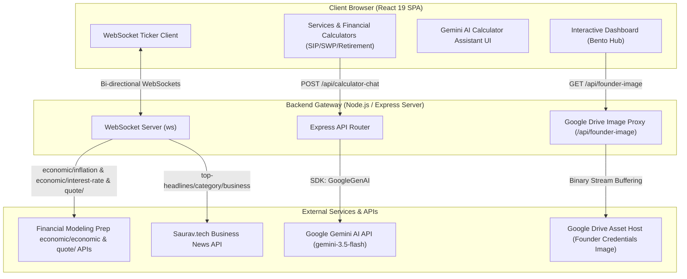

# FinAura Capital

<p align="center">
  
  
  
</p>

> **Premium Wealth Management & Mutual Funds Advisory Suite**
>
> A high-fidelity, interactive financial advisory portal designed to empower retail investors with mathematical calculators, real-time market data tickers, dynamic news feeds, and an AI-driven financial education assistant. Led by NISM-Certified distributor Shubham Dalvi, the platform blends robust client tools with a direct WhatsApp-integrated advisory channel.

---

## 🔗 Credentials & Quick Connections

| Credentials & Regulatory Info | Client Portals & Actions | Digital Presence |
| :--- | :--- | :--- |
| 🛡️ **AMFI Registration:** [ARN-353581](http://p.njw.bz/103924) | 🔑 **Wealth Desk:** [EWA NJ Wealth Login](https://ewa.njindiaonline.com/ewa/login) | 💼 **LinkedIn:** [Shubham Dalvi Profile](https://www.linkedin.com/in/finaura-capital-813770388/) |
| 🎗️ **NJ Wealth Partner:** Code 103924 | 💬 **Advisory Channel:** [WhatsApp Enquiry](https://wa.me/919423669236) | 📸 **Instagram:** [@finnauracapital](https://www.instagram.com/finnauracapital) |
| 🎓 **Compliance:** NISM Series V-A | 📡 **System Health:** `/api/health` | 📘 **Facebook:** [FinAura Capital Page](https://www.facebook.com/share/18ehkCsPPh/?mibextid=wwXIfr) |

---

## 🏗️ System Architecture

FinAura Capital is structured as a fullstack application, leveraging a single unified Express server during development (integrated with Vite middlewares) and production:



---

## 🌟 Core Pillars & Functional Highlights

### 🧭 Navigation & Bento Hub Control Panel
- **Bento Grid Layout**: A sleek navigation grid routing users seamlessly between equity allocations, compounding calculators, defensive cushions, and advisory credentials.
- **Contextual Advisory Banner**: Features rotating advisory guidelines authored by Shubham Dalvi, updating dynamically based on selected services and active filters.

### 📊 Interactive Compounding & Analytical Suite
- **Systematic Investment Plan (SIP) Outpost**: High-fidelity compounding simulation projecting principal capital vs. accrued returns, highlighting the final wealth multiplier.
- **Systematic Withdrawal Plan (SWP) Outpost**: Retirement cash-flow simulator that analyzes corpus sustainability, helping users determine safe withdrawal limits.
- **Goal & Retirement Planners**: Backward-calculators that compute the precise monthly savings required today to target a future inflation-adjusted nest egg.
- **Tactical Defensive Shield**: A customizable sandbox helping users budget a 3, 6, or 12-month occupational and emergency reserve against market volatility.
- **Enhanced UX Input Controls**: Advanced slider-input dual controls. Allows easy text clearing and backspacing without component freezes, falling back smoothly to `0`.

### 🤖 Gemini-Powered Calculator Assistant
- **Calculator Context Awareness**: An embedded educational chat widget that detects which calculator is active and reads its input parameters (e.g., principal, time, expected return) automatically.
- **Financial Literacy Agent**: Translates mathematical figures into plain-English summaries, explains the compounding curve, highlights assumptions (such as constant returns), and suggests actionable steps.
- **Zero-Key Deterministic Fallback**: In the absence of a configured Gemini API key, the system transitions to a local keyword-matching regex system to answer general questions on SIP, SWP, and market index returns.

### 📱 Zero-Overhead Lead Routing
- **WhatsApp Inquiry Generator**: A structured intake form allowing prospective clients to state their target services and details.
- **Parser Engine**: Converts the input fields into a clean, markdown-style textual summary, automatically redirecting the user to WhatsApp support (+91 94236 69236) for direct consultation.

---

## 📂 Codebase Directory Structure

```
.
├── server.ts                 # Main Express server, WebSocket engine, and API routes
├── package.json              # Dependencies, build configs, and CLI scripts
├── tsconfig.json             # Compiler rules for TypeScript
├── vite.config.ts            # Bundler configuration and Tailwind CSS integration
├── vercel.json               # Serverless settings for Vercel deployment
├── .env.example              # Environment variables template
├── index.html                # Main entry HTML document for Vite
└── src
    ├── main.tsx              # React mounting root
    ├── App.tsx               # Client state manager and navigation router
    ├── index.css             # Tailwind global style directives and UI variables
    ├── components
    │   ├── About.tsx         # Founder credential cards, bio, and AMFI certifications
    │   ├── BentoHub.tsx      # Responsive Bento Grid navigation dashboard
    │   ├── CalculatorAIAssistant.tsx # Embedded Gemini Chat sidebar widget
    │   ├── Calculators.tsx   # Sliders, calculations, and tables for SIP/SWP/Goal
    │   ├── Contact.tsx       # WhatsApp form layout and parsing logic
    │   ├── FinauraLogo.tsx   # Custom vector branding emblem
    │   ├── Footer.tsx        # Dynamic footer with disclaimers and navigation links
    │   ├── Hero.tsx          # Marketing splash header and value proposition
    │   ├── HeroBackground.tsx# Visual background canvas / decorative components
    │   ├── MarketTicker.tsx  # WebSocket live market price ticker bar
    │   ├── Navbar.tsx        # Responsive client navbar header
    │   ├── NewsFeed.tsx      # WebSocket business news feed container
    │   ├── PartnerLoginModal.tsx # Login overlay shortcut for the EWA Desk Portal
    │   ├── Services.tsx      # Services component managing state between Calculators and Bento
    │   └── WhatsAppButton.tsx# Persistent floating button for quick WhatsApp access
    ├── hooks                 # Custom React utility hooks
    └── lib                   # Constants, helper functions, and shared configs
```

---

## 🛠️ Getting Started & Local Setup

### ⚙️ Environment Variables
The application's runtime behavior changes dynamically depending on the configured API keys in the `.env` file:

| Variable | Source | Required For | Fallback Behavior |
| :--- | :--- | :--- | :--- |
| `FINANCIAL_API_KEY` | [Financial Modeling Prep](https://financialmodelingprep.com/) | Real-time stock prices & economic indicators | Simulated stock random walk & economic parameters |
| `GEMINI_API_KEY` | [Google AI Studio](https://aistudio.google.com/) | Interactive Calculator Chat Assistant | Deterministic local rule engine (SIP, SWP, FD advice) |

### 🚀 Running the App Locally

1. **Clone the Repository**:
   ```bash
   git clone <your-repository-url>
   cd finaura-capital
   ```

2. **Configure Environment Variables**:
   Create a `.env` file in the project root based on the template:
   ```bash
   cp .env.example .env
   ```
   Add your respective `FINANCIAL_API_KEY` and `GEMINI_API_KEY` keys.

3. **Install Dependencies**:
   ```bash
   npm install
   ```

4. **Verify TypeScript & Build Integrity**:
   - Run type-checking linter:
     ```bash
     npm run lint
     ```
   - Compile the static Vite client:
     ```bash
     npm run build
     ```

5. **Start Local Development Server**:
   ```bash
   npm run dev
   ```
   This compiles and mounts the Vite frontend middleware alongside the Express server, running on **`http://localhost:3000`**.

---

## ⚖️ Regulatory Compliance & Disclaimers

> [!WARNING]
> **Mutual Fund Disclaimer**: Mutual fund investments are subject to market risks. Please read all scheme-related documents carefully before investing. Past performance is not an indicator of future returns.

> [!IMPORTANT]
> **Regulatory Information**: FinAura Capital operates as an authorized mutual fund distributor under the Association of Mutual Funds in India (AMFI) Guidelines.
> - **AMFI Registration Number (ARN):** ARN-353581
> - **NJ Wealth Partner Code:** 103924
> - **Principal Distributor Representative:** NISM Series V-A Certified Partner, Shubham Dalvi
> - **Client EWA Platform Provider:** NJ Wealth Desk (Link verified at [p.njw.bz/103924](http://p.njw.bz/103924))

---
*FinAura Capital — Systematically Compounding and Defending Your Hard-Earned Wealth.*
