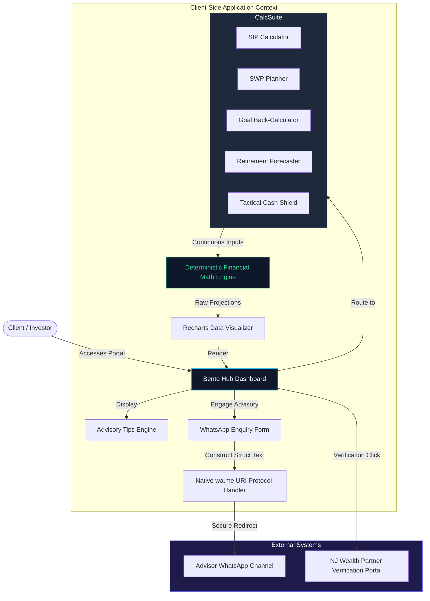

# FinAura Capital

<div align="center">


<br />

[](https://drive.google.com/file/d/16VAKCq27GVd9-KcBID1b8h7cPZJPV8r3/view?usp=drive_link)

[](http://p.njw.bz/103924)


<br />

[**Live Platform**](https://finncap-in.vercel.app/) &nbsp;·&nbsp; [**NJ Wealth Portal**](http://p.njw.bz/103924) &nbsp;·&nbsp; [**WhatsApp Advisory**](https://wa.me/919423669236) &nbsp;·&nbsp; [**Instagram Profile**](https://www.instagram.com/finnauracapital) &nbsp;·&nbsp; [**LinkedIn**](https://www.linkedin.com/in/finaura-capital-813770388/)

<br /><br />

[](https://finncap-in.vercel.app/)

*Enterprise Wealth Advisory Portal & Interactive Compounding Suite*

</div>

---

## 📋 Executive Overview

**FinAura Capital** is an enterprise-grade financial analytics and wealth management advisory portal designed for modern retail and high-net-worth investors in India. Built and curated by **Shubham Dalvi** — a NISM-certified mutual fund distributor affiliated with NJ Wealth — the suite delivers institutional-quality planning and compound simulators through a premium, interactive user interface.

The platform bridges the gap between complex financial planning and everyday wealth management. By offering clients high-fidelity forecasting engines (SIP, SWP, Goal Planner, and Retirement Estimators) alongside a client-side, privacy-preserving WhatsApp routing system, FinAura Capital ensures seamless, secure, and compliance-first advisory workflows.

---

## 🏛️ System Architecture & Data Flow

FinAura Capital operates as a client-side calculation application to prioritize user privacy and ensure instant mathematical calculations with zero server lag.



---

## 🛡️ Regulatory Compliance & Distribution Credentials

FinAura Capital operates under a strict compliance framework. Below are the verified credentials of the distributor:

| Regulatory Attribute | Licensed Status / Value | Verification Source |
| :--- | :--- | :--- |
| **Licensed Distributor** | Shubham Dalvi | Individual Brokerage Code |
| **AMFI Registration Number** | **ARN-353581** | Association of Mutual Funds in India |
| **NISM Certification** | [Series V-A: Mutual Fund Distributors](https://drive.google.com/file/d/16VAKCq27GVd9-KcBID1b8h7cPZJPV8r3/view?usp=drive_link) | [NISM Certificate Verification](https://drive.google.com/file/d/16VAKCq27GVd9-KcBID1b8h7cPZJPV8r3/view?usp=drive_link) |
| **Franchise Affiliation** | NJ India Invest Pvt. Ltd. | NJ Wealth Distributor Network |
| **NJ Wealth Partner Code** | **103924** | Franchise Sub-broker Code |
| **Distributor Verification** | [p.njw.bz/103924](http://p.njw.bz/103924) | [Live Portal Verification Page](http://p.njw.bz/103924) |
| **Regulatory Jurisdiction** | SEBI & AMFI Compliant | Government of India |

---

## 🧮 Mathematical Modeling & Core Calculations

The application runs deterministic cash-flow models to project client wealth parameters. Below are the exact equations implemented in the math utilities:

### 1. Systematic Investment Plan (SIP)
To calculate the future value ($FV$) of systematic monthly payments ($P$) compounding monthly at an annual rate ($r$) for $n$ months, the equation is:
$$FV = P \times \frac{\left(1 + i\right)^n - 1}{i} \times \left(1 + i\right)$$
Where $i$ is the monthly interest rate:
$$i = \frac{r}{12 \times 100}$$

### 2. Systematic Withdrawal Plan (SWP)
To determine the longevity and remaining corpus ($C_t$) of a starting principal ($PV$) after regular monthly withdrawals ($W$) compounding at interest rate $i$ for $t$ months:
$$C_t = PV \times (1 + i)^t - W \times \frac{(1 + i)^t - 1}{i}$$
If inflation-adjustment is enabled, the withdrawal $W_t$ increases annually:
$$W_t = W_0 \times (1 + f)^{\lfloor t/12 \rfloor}$$
*(Where $f$ is the annual inflation rate)*

### 3. Goal-Based Backward Induction
To calculate the required monthly systematic installment ($P$) to hit a target future corpus ($FV$) over $n$ periods:
$$P = \frac{FV \times i}{\left((1 + i)^n - 1\right) \times (1 + i)}$$

### 4. Retirement Need Estimation
Determines the required retirement target corpus ($RC$) at age $R_{age}$ to sustain inflation-adjusted monthly expenses ($E$) across a lifespan ending at $L_{exp}$:
$$RC = \sum_{k=1}^{12 \times (L_{exp} - R_{age})} E \times \frac{(1 + f_m)^k}{(1 + i_m)^k}$$
*(Where $f_m$ and $i_m$ are monthly adjusted inflation and post-retirement return rates respectively)*

---

## 🔒 Client Data Privacy & Security Protocols

FinAura Capital adopts a **zero-trust, database-free architecture** to maximize client data security and align with regulatory guidelines:

1.  **State Isolation**: Financial parameters inputted into the sliders remain purely in the volatile state of the user's browser. Once the tab is closed, all planning numbers are permanently discarded.
2.  **No Server-Side Storing (PII)**: Personally Identifiable Information (PII) is not sent to any database.
3.  **Cryptographically Safe Redirection**: 
    The enquiry form structures data client-side and translates it into standard URI escape codes. It redirects the client using the browser's native `Window.location.replace` protocol directly to the distributor's secure WhatsApp terminal:
    ```
    https://wa.me/919423669236?text=Name%3A%20John%20Doe%0AEmail%3A%20john%40example.com%0AService%3A%20SIP%20Planning
    ```

---

## 🚀 Key Functional Features

### 1. Bento Grid Navigation Control Panel
An intuitive, responsive grid dashboard modeled after modern UI patterns. It dynamically guides users to specialized planning tools, educational materials, and verified distributor license cards.

### 2. High-Precision Calculator Engines
All calculators feature real-time update triggers, standard zero-clearing fallback routines, and synchronized visual representations:
*   **SIP Wealth Accumulator**: Models long-term compounding using systematic monthly inflows with variables for expected rate of return and time horizon.
*   **SWP Income Planner**: Simulates retirement income generation and estimates remaining corpus longevity across multiple return rates, helping clients define sustainable withdrawal schedules.
*   **Target Goal Planner**: Uses backward induction algorithms to determine the exact monthly contribution required to reach a specific financial goal.
*   **Comprehensive Retirement Planner**: Integrates variables such as current age, target retirement age, life expectancy, post-retirement inflation, and desired monthly income.
*   **Tactical Defensive Shield**: A risk-modeling module that calculates customized emergency fund sizes (3, 6, or 12 months) based on job security risk, fixed expenses, and dependents.

### 3. Contextual Advisory Banner
A dynamic carousel providing rotating financial education tips, compliance warnings, and market reminders curated directly by the NISM-certified distributor.

---

## 🛠️ Technology Stack

| Layer | Implementation Component | Technical Features |
| :--- | :--- | :--- |
| **Frontend Framework** | React 18+ (Vite Build) | Virtual DOM rendering for calculator responsiveness |
| **Styling Engine** | Tailwind CSS & Vanilla CSS | Modular styling, theme variable configuration |
| **Animation Engine** | Framer Motion | Viewport entrance animations and smooth micro-transitions |
| **Data Visualization** | Recharts | Responsive SVG vector line & bar charts |
| **Asset Icons** | Lucide React | Clean, scalable vector symbols |
| **Backend Integration** | Node.js / Express | Modular server endpoints for static assets |
| **Deep-linking Broker** | Native WA Protocol (`wa.me`) | Browser-to-app communication |

---

## 💻 Core Code Walkthrough

Below is the implementation of the core financial utility function handling standard compounding projections. It is exported under `src/utils/financeMath.js`:

```javascript
/**
 * Calculates systematic monthly investment compounding parameters.
 * @param {number} monthlyInvestment - Principal added monthly (P)
 * @param {number} annualRate - Expected yearly return rate (%)
 * @param {number} years - Duration in years (t)
 * @returns {Object} Total invested, interest earned, and final projected value
 */
export const calculateSIP = (monthlyInvestment, annualRate, years) => {
  const P = Number(monthlyInvestment);
  const r = Number(annualRate);
  const t = Number(years);

  if (isNaN(P) || isNaN(r) || isNaN(t) || P <= 0 || t <= 0) {
    return { totalInvested: 0, interestEarned: 0, finalValue: 0 };
  }

  const i = r / (12 * 100); // Monthly rate
  const n = t * 12;         // Total months

  // FV = P * [((1 + i)^n - 1) / i] * (1 + i)
  const finalValue = P * (((Math.pow(1 + i, n) - 1) / i) * (1 + i));
  const totalInvested = P * n;
  const interestEarned = Math.max(0, finalValue - totalInvested);

  return {
    totalInvested: Math.round(totalInvested),
    interestEarned: Math.round(interestEarned),
    finalValue: Math.round(finalValue)
  };
};
```

---

## 📥 Developer Installation & Configuration

### Prerequisites
*   **Node.js** Version $\ge$ 18.x
*   **npm** Version $\ge$ 9.x

### Deployment Instructions

```bash
# 1. Clone the repository codebase
git clone <your-repository-url>
cd finaura-capital

# 2. Install production and development dependencies
npm install

# 3. Establish environmental configuration files
cp .env.example .env
# Open the .env file in your editor and configure variables
```

### Script Profiles

*   **Local Development Server** (Runs server with Hot Module Replacement):
    ```bash
    npm run dev
    ```
*   **Build Engine** (Optimizes and builds production-ready assets):
    ```bash
    npm run build
    ```
*   **Local Production Preview**:
    ```bash
    npm run preview
    ```

---

## 🗂️ Codebase Structure

```
finaura-capital/
├── public/                  # Public static assets & global icons
├── src/                     # Source assets
│   ├── components/          # Reusable components
│   │   ├── BentoHub/        # Bento Layout Dashboard Component
│   │   ├── Calculators/     # Calculation Modules (SIP, SWP, Goal, etc.)
│   │   ├── AdvisoryBanner/  # Dynamic Rotating Tips Carousel
│   │   └── WhatsAppForm/    # Client Enquiry Handler
│   ├── pages/               # Top-level Page Router Views
│   ├── hooks/               # Custom Hooks (Math calculations, window size)
│   ├── utils/               # Financial mathematical logic helper functions
│   ├── styles/              # Global stylesheet variables and Tailwind config
│   └── main.jsx             # React framework bootstrap entry point
├── server/                  # Optional backend assets (Node.js/Express)
│   └── index.js
├── .env.example             # Template for configuration environment variables
├── tailwind.config.js       # Custom Tailwind configuration
├── vite.config.js           # Configuration schema for Vite compilation
└── package.json             # Package configuration file
```

---

## ⚙️ Configuration Variables (`.env`)

To run the application locally or on a production node, establish the following keys in your `.env` file at the root:

```env
# Application Context
VITE_APP_NAME=FinAura Capital
VITE_APP_URL=https://finncap-in.vercel.app/

# Advisory Channel Parameters
VITE_WA_NUMBER=919423669236
VITE_ADVISOR_NAME=Shubham Dalvi

# Distribution & Compliance Parameters
VITE_ARN_CODE=ARN-353581
VITE_NJ_PARTNER_CODE=103924
VITE_NJ_PORTAL_URL=https://p.njw.bz/103924
```

---

## 🏛️ Credentials & AMFI Code of Conduct

**Shubham Dalvi** operates as an AMFI-registered mutual fund distributor (ARN-353581) and is affiliated with the NJ Wealth network (Partner Code: 103924). All activities on the FinAura Capital platform strictly adhere to the guidelines set forth by:

1.  **SEBI** (Securities and Exchange Board of India): Advisory restrictions, transparency mandates, and investor data protections.
2.  **AMFI** (Association of Mutual Funds in India): Circular compliance, ethical distribution procedures, and structured commission disclosures.
3.  **NISM Series V-A standards**: Competency and professional advisory protocols.

*Distributor verification card can be checked at: [p.njw.bz/103924](http://p.njw.bz/103924)*

---

## 🤝 Professional Inquiries & Social Channels

| Platform | Channel Destination / Reference |
| :--- | :--- |
| **Instagram Business** | [@finnauracapital](https://www.instagram.com/finnauracapital) |
| **LinkedIn Professional** | [Shubham Dalvi — LinkedIn Profile](https://www.linkedin.com/in/finaura-capital-813770388/) |
| **Facebook Network** | [FinAura Capital Page](https://www.facebook.com/share/18ehkCsPPh/?mibextid=wwXIfr) |
| **Direct Advisory Line** | [WhatsApp Client Routing (+91 94236 69236)](https://wa.me/919423669236) |

---

## ⚠️ Standard Regulatory Disclaimer

> **Mutual fund investments are subject to market risks. Please read all scheme-related documents carefully before investing. Past performance is not indicative of future results.**
>
> FinAura Capital operates exclusively as an **AMFI-registered mutual fund distributor** (ARN-353581) and does not offer SEBI-registered investment advisory services. Calculators, analytics, and projections presented on this portal are for simulation and financial education purposes only, and should not be construed as investment advice, recommendations, or buy/sell requests.

---

<div align="center">

**FinAura Capital** &nbsp;·&nbsp; AMFI Registered ARN-353581 &nbsp;·&nbsp; NISM Series V-A Certified

*Systematically Compounding and Defending Your Hard-Earned Wealth*

</div>
