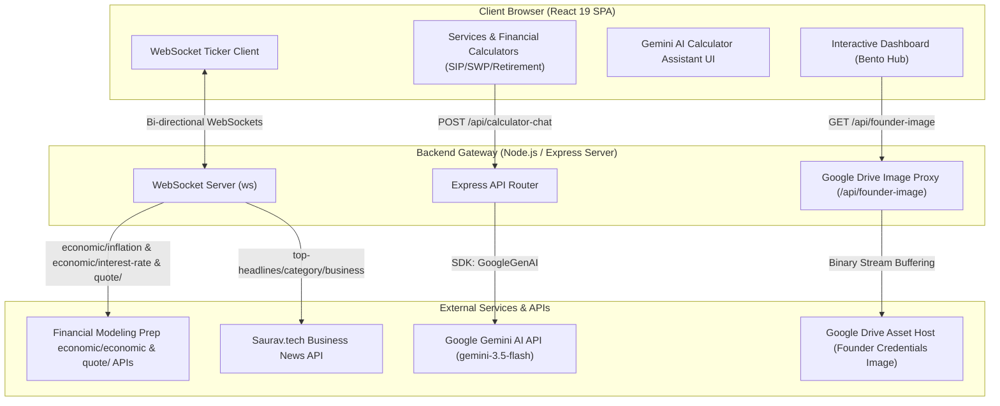

# FinAura Capital

<p align="center">
  
  
  
</p>

> **Premium Wealth Management & Mutual Funds Advisory Suite**
>
> A high-fidelity, interactive financial advisory portal designed to empower retail investors with mathematical calculators, real-time market data tickers, dynamic news feeds, and an AI-driven financial education assistant. Led by NISM-Certified distributor Shubham Dalvi, the platform blends robust client tools with a direct WhatsApp-integrated advisory channel.

---

## 🔗 Credentials & Quick Connections

| Credentials & Regulatory Info | Client Portals & Actions | Digital Presence |
| :--- | :--- | :--- |
| 🛡️ **AMFI Registration:** [ARN-353581](http://p.njw.bz/103924) | 🔑 **Wealth Desk:** [EWA NJ Wealth Login](https://ewa.njindiaonline.com/ewa/login) | 💼 **LinkedIn:** [Shubham Dalvi Profile](https://www.linkedin.com/in/finaura-capital-813770388/) |
| 🎗️ **NJ Wealth Partner:** Code 103924 | 💬 **Advisory Channel:** [WhatsApp Enquiry](https://wa.me/919423669236) | 📸 **Instagram:** [@finnauracapital](https://www.instagram.com/finnauracapital) |
| 🎓 **Compliance:** NISM Series V-A | 📡 **System Health:** `/api/health` | 📘 **Facebook:** [FinAura Capital Page](https://www.facebook.com/share/18ehkCsPPh/?mibextid=wwXIfr) |

---

## 🏗️ System Architecture

FinAura Capital is structured as a fullstack application, leveraging a single unified Express server during development (integrated with Vite middlewares) and production:



---

## 🌟 Core Pillars & Functional Highlights

### 🧭 Navigation & Bento Hub Control Panel
- **Bento Grid Layout**: A sleek navigation grid routing users seamlessly between equity allocations, compounding calculators, defensive cushions, and advisory credentials.
- **Contextual Advisory Banner**: Features rotating advisory guidelines authored by Shubham Dalvi, updating dynamically based on selected services and active filters.

### 📊 Interactive Compounding & Analytical Suite
- **Systematic Investment Plan (SIP) Outpost**: High-fidelity compounding simulation projecting principal capital vs. accrued returns, highlighting the final wealth multiplier.
- **Systematic Withdrawal Plan (SWP) Outpost**: Retirement cash-flow simulator that analyzes corpus sustainability, helping users determine safe withdrawal limits.
- **Goal & Retirement Planners**: Backward-calculators that compute the precise monthly savings required today to target a future inflation-adjusted nest egg.
- **Tactical Defensive Shield**: A customizable sandbox helping users budget a 3, 6, or 12-month occupational and emergency reserve against market volatility.
- **Enhanced UX Input Controls**: Advanced slider-input dual controls. Allows easy text clearing and backspacing without component freezes, falling back smoothly to `0`.

### 🤖 Gemini-Powered Calculator Assistant
- **Calculator Context Awareness**: An embedded educational chat widget that detects which calculator is active and reads its input parameters (e.g., principal, time, expected return) automatically.
- **Financial Literacy Agent**: Translates mathematical figures into plain-English summaries, explains the compounding curve, highlights assumptions (such as constant returns), and suggests actionable steps.
- **Zero-Key Deterministic Fallback**: In the absence of a configured Gemini API key, the system transitions to a local keyword-matching regex system to answer general questions on SIP, SWP, and market index returns.

### 📱 Zero-Overhead Lead Routing
- **WhatsApp Inquiry Generator**: A structured intake form allowing prospective clients to state their target services and details.
- **Parser Engine**: Converts the input fields into a clean, markdown-style textual summary, automatically redirecting the user to WhatsApp support (+91 94236 69236) for direct consultation.

---

## 🧮 Calculator Mathematical Formulations

All calculations inside `src/lib/calculatorMath.ts` are based on standard actuarial and financial compound formulas.

### 1. Systematic Investment Plan (SIP)
Calculates the Future Value ($FV$) of periodic monthly payments (Annuity Due):
$$FV = P \times \frac{(1 + r)^n - 1}{r} \times (1 + r)$$

Where:
- $P$ = Monthly installment amount.
- $r$ = Monthly interest rate ($\text{Annual Expected Return} \div 12 \div 100$).
- $n$ = Total number of compounding periods ($\text{Years} \times 12$).

---

### 2. Systematic Withdrawal Plan (SWP)
A recurrent monthly decay sequence tracks capital drawdown:
$$Balance_{m+1} = Balance_m \times (1 + r) - W$$

Where:
- $Balance_m$ = Remaining portfolio corpus at month $m$ ($Balance_0 = \text{Initial Corpus}$).
- $r$ = Monthly compounding growth rate ($\text{Annual Expected Return} \div 12 \div 100$).
- $W$ = Fixed monthly systematic withdrawal payout.
- *Sustainability Check*: If $Balance_m$ declines to $\le 0$ within 600 months (50 years), the strategy is marked as depleting; otherwise, it is flagged as indefinitely sustainable.

---

### 3. Systematic Transfer Plan (STP)
Relocates capital monthly from a low-volatility source fund (Debt) to a target asset (Equity):
$$SourceBalance_{m+1} = SourceBalance_m \times (1 + r_s) - T$$
$$TargetBalance_{m+1} = (TargetBalance_m + T) \times (1 + r_t)$$

Where:
- $r_s$ = Monthly interest rate of the Source Fund.
- $r_t$ = Monthly interest rate of the Target Fund.
- $T$ = Periodic transfer volume.

---

### 4. Nest-Egg Retirement Planner
1. **Inflation-Adjusted Monthly Expenses**:
   $$F_{exp} = C_{exp} \times (1 + I)^y$$
   Where $C_{exp}$ is current monthly expenditure, $I$ is the annual inflation rate, and $y$ is the years remaining until retirement ($\text{Retire Age} - \text{Current Age}$).
2. **Target Accumulation Corpus**:
   Assuming a standard post-retirement capital protection rate of $8\%$ p.a. and a $20$-year structured payout lifespan:
   $$r_{real} = \frac{1 + 0.08}{1 + I} - 1$$
   $$Corpus = (F_{exp} \times 12) \times \frac{1 - (1 + r_{real})^{-20}}{r_{real}}$$
3. **Required Monthly Pre-Retirement SIP Savings**:
   $$P_{savings} = \frac{Corpus}{\frac{(1 + r_{pre})^n - 1}{r_{pre}} \times (1 + r_{pre})}$$
   Where $r_{pre}$ is the expected pre-retirement asset compounding return rate.

---

### 5. Equated Monthly Installment (EMI)
Calculates monthly debt amortization installments:
$$EMI = P \times \frac{r(1 + r)^n}{(1 + r)^n - 1}$$

Where:
- $P$ = Loan Principal.
- $r$ = Monthly interest rate ($\text{Annual Rate} \div 12 \div 100$).
- $n$ = Loan term in months.

---

### 6. Goal-Based Planner
Solves for the required monthly systematic inflows ($P_{savings}$) to achieve a target future milestone sum ($FV_{target}$):
$$P_{savings} = \frac{FV_{target}}{\frac{(1 + r)^n - 1}{r} \times (1 + r)}$$

---

## 🔄 Client State Management & UI Data Flows

The client-side layout is driven by standard React state reactivity, ensuring instant recalculations and fluid animations across charts and components:

```
[ Slider / Numeric Inputs ] ───► Updates React State Variables (e.g., amount, rate)
                                                 │
                                                 ├───► Recalculate Mathematical Engines
                                                 │     (pure functions inside calculatorMath.ts)
                                                 │
                                                 ├───► Sync Output Results to DOM & Metrics
                                                 │
                                                 ├───► Rechart Graphics Rendering
                                                 │     (PieChart allocation & AreaChart curves)
                                                 │
                                                 └───► Propagate Updated State Objects
                                                       to Floating AI Assistant Widget
```

### Key State Integration Features
- **Dual-Control Sync**: Dragging sliders or entering numeric keys updates a common `useState` state hook. Input text buffers allow complete backspacing (`""` state) without throwing runtime parser errors, reverting to a temporary UI value of `0`.
- **Chart Ingestion Structures**: Math returns include a chronological `chartData` array containing computed objects `{ name: string, Invested: number, Value: number }`. These are piped directly into Recharts `<AreaChart />` components, rendering compound interest curves.
- **AI Chatbot Synchronization**: The active tab index (`sip` | `swp` | `retirement` etc.) is tracked globally in `App.tsx` and combined with parameter state objects to populate `calculatorData` context. This is passed directly into the `<CalculatorAIAssistant />` component, ensuring the chatbot stays context-aware.

---

## 📡 WebSocket Lifecycle & Offline Resiliency Protocol

Real-time price feeds, inflation indexes, and business news streams are pushed to connected browsers using a persistent WebSocket connection.

```
            [ App Mounts: Attempt WS Connection ]
                            │
              ┌─────────────┴─────────────┐
              ▼                           ▼
      [ Connection OK ]            [ Connection Fails ]
              │                           │
              ├─► STOCK_UPDATE            ├─► Activate Local Simulation
              ├─► MARKET_INDICATORS       │   (Random Walk stock pricing)
              └─► NEWS_UPDATE             │
                                          ▼
                               [ Retry with Backoff ]
                             (2s -> 4s -> 8s ... Max 30s)
```

### Connection Management
1. **Handshake**: The client triggers a WebSocket handshake using the standard URL scheme:
   ```typescript
   const ws = new WebSocket(window.location.origin.replace(/^http/, 'ws'));
   ```
2. **Event Dispatching**: Broadcast payloads are parsed and dispatched dynamically to React states based on the package envelope property `type`:
   - `STOCK_UPDATE`: Synchronizes stock listings in the bento and goals components.
   - `MARKET_INDICATORS`: Updates macroeconomic thresholds (national inflation, repo rates).
   - `NEWS_UPDATE`: Pushes the latest business news array to the layout.

### Resiliency Features
- **Reconnection Loop with Backoff**: If the socket connection drops or is terminated, the client initiates a reconnection loop. It retries connection at increasing intervals (2 seconds, doubling up to a maximum of 30 seconds) to prevent server inundation during restarts.
- **Local Fallback Mode**: If the client is disconnected or running offline, the UI falls back to simulated pricing models (e.g., Random Walk models for equities) to maintain an active experience.

---

## 🎨 Tailwind CSS Design System & Theme Variables

FinAura Capital implements a highly refined typography and glassmorphic layout system styled via Tailwind CSS custom directives:

### ⚙️ Core Theme Tokens (`src/index.css`)
Custom configurations are registered directly in the Tailwind `@theme` configuration:
- **Typography**: 
  - Sans-Serif: `"DM Sans"` (modern readability for numbers and sliders).
  - Serif: `"Playfair Display"` (classic premium style for branding headers).
- **Core Wealth Colors**:
  - `--color-gold`: `#C9A84C` (wealth management theme gold).
  - `--color-gold-light`: `#E8C97A` (hover accents).
  - `--color-gold-dim`: `#8a6f30` (borders and inactive states).

### 🌓 Theme Variable Overrides
The styling system changes HSL background values based on dark mode class selectors:
- **Light Theme**: `--background: 245 242 235` (warm ivory), `--foreground: 26 26 24` (coal text).
- **Dark Theme**: `--background: 10 10 12` (midnight blue), `--foreground: 240 237 230` (off-white).

### ✨ Custom Utility Classes
- **Glassmorphism (`.glass`)**: Applies `backdrop-blur-lg` filters over a highly transparent white or black background.
  ```css
  .glass {
    backdrop-filter: blur(16px);
    background-color: rgba(255, 255, 255, 0.1);
    border: 1px solid rgba(255, 255, 255, 0.2);
  }
  ```
- **Live Ticker Animation (`.animate-ticker`)**: A smooth, infinite CSS keyframe animation moving index values translationally over 110 seconds. The animation pauses on hover for readability.

---

## 🧪 QA & Unit Testing Suite Blueprint

Mathematical engines are verified using pure unit tests to prevent regression errors. The following test layout outlines the verification logic (implementable with Vitest or Jest):

### Unit Test Specifications (`calculatorMath.test.ts`)
```typescript
import { describe, it, expect } from 'vitest';
import { calculateSIP, calculateSWP, calculateEMI } from './calculatorMath';

describe('Financial Compounding Engine', () => {
  
  it('should calculate SIP returns correctly under positive interest rates', () => {
    const result = calculateSIP(5000, 12, 10);
    expect(result.futureValue).toBeGreaterThan(600000); // 10-year compounding threshold
    expect(result.totalInvested).toBe(600000); // 5000 * 12 * 10
    expect(result.chartData.length).toBe(10); // Yearly tracking output
  });

  it('should fall back gracefully to linear accumulation under 0% interest', () => {
    const result = calculateSIP(1000, 0, 5);
    expect(result.futureValue).toBe(60000); // Linear projection (1000 * 12 * 5)
    expect(result.estimatedReturns).toBe(0);
  });

  it('should flag SWP as sustainable if withdrawal rate matches growth rate', () => {
    const result = calculateSWP(1000000, 8000, 10); // withdrawing ~8% per year
    expect(result.isSustainableIndefinitely).toBe(true);
    expect(result.remainingBalance).toBeGreaterThan(0);
  });

  it('should trace principal decay to zero for depleting SWP strategies', () => {
    const result = calculateSWP(1000000, 50000, 6); // high payout of 50k/month
    expect(result.isSustainableIndefinitely).toBe(false);
    expect(result.remainingBalance).toBe(0);
    expect(result.monthsActive).toBeLessThan(600); // depletes before 50-year cap
  });

  it('should solve exact amortization allocations for EMI calculations', () => {
    const result = calculateEMI(1200000, 8.5, 15);
    const expectedEMI = 11812.5; // Theoretical value
    expect(result.monthlyEMI).toBeCloseTo(expectedEMI, -1);
    expect(result.totalPayment).toBeCloseTo(expectedEMI * 180, -1);
  });
});
```

---

## 🖥️ Vercel Serverless & Proxy Architecture

When deploying to Vercel, the configuration in `vercel.json` decouples client requests and server API routing.

### 1. Serverless Routing Configuration
- **Static Assets**: Rewritten to `/dist` directories populated by the Vite client build compiler.
- **API Delegation**: Any request directed to `/api/(.*)` is dynamically routed to the backend script `server.ts` executed inside Vercel's Node.js serverless execution environment.
  ```json
  "routes": [
    { "src": "/api/(.*)", "dest": "server.ts" },
    { "src": "/assets/(.*)", "dest": "/assets/$1" },
    { "src": "/(.*)", "dest": "/index.html" }
  ]
  ```

### 2. Google Drive Image Proxying (`/api/founder-image`)
To bypass strict Google Drive CDN hotlinking blocks and protect image assets, the Express server acts as a proxy:
1. **Multi-Strategy Request**: The server sequentially polls Google Drive APIs (Thumbnail, lh3 endpoints, direct download handles) using Chrome user agent headers.
2. **Buffer Conversion**: The returned response is converted to an ArrayBuffer, buffered into memory, and returned to the browser with standard cache headers:
   ```typescript
   res.setHeader("Content-Type", "image/jpeg");
   res.setHeader("Cache-Control", "public, max-age=86400"); // 24-hour cache
   res.send(Buffer.from(arrayBuffer));
   ```
3. **Redirect Fallback**: If server-side fetch requests fail (likely due to Vercel IP blocks), the server returns a 302 redirection directly to the browser-level image source.

---

## 📡 WebSockets & REST API Specifications

The server exposes WebSockets for real-time updates and REST endpoints for UI interactivity.

### 1. WebSocket Event Broadcaster
In standalone/persistent mode, the server opens a WebSocket gateway on port `3000` to broadcast market indicators, stock quotes, and news updates:

#### Event: `STOCK_UPDATE`
Broadcasts stock updates. Simulated updates push every 2 seconds; live FMP data updates every 10 seconds.
```json
{
  "type": "STOCK_UPDATE",
  "data": [
    {
      "name": "NIFTY 50",
      "price": 24356.55,
      "change": 0.43,
      "high": 24410.2,
      "low": 24290.15,
      "volume": 245600000,
      "marketCap": 185000000000000
    }
  ]
}
```

#### Event: `MARKET_INDICATORS`
Broadcasts macroeconomic factors. Pushed on client initialization and updated every 10 minutes.
```json
{
  "type": "MARKET_INDICATORS",
  "data": {
    "inflation": 6.0,
    "interestRate": 8.5,
    "marketReturn": 12.0,
    "goldRate": 73245
  }
}
```

#### Event: `NEWS_UPDATE`
Broadcasts business news updates. Fetched and pushed every 5 minutes.
```json
{
  "type": "NEWS_UPDATE",
  "data": [
    {
      "title": "Market Update: NIFTY 50 hits new high",
      "description": "The Indian stock market continues its bullish trend...",
      "url": "https://example.com/news/1",
      "urlToImage": "https://picsum.photos/seed/market/800/400"
    }
  ]
}
```

---

### 2. REST API Routes

#### `GET /api/health`
- **Description**: Verifies service status.
- **Response**:
  ```json
  { "status": "ok" }
  ```

#### `GET /api/stocks`
- **Description**: Returns the latest list of simulated or FMP-fetched stocks.
- **Response**: Array of stock objects matching `STOCK_UPDATE` payload.

#### `GET /api/indicators`
- **Description**: Returns active inflation, interest rates, and expected benchmarks.
- **Response**: Matches `MARKET_INDICATORS` payload.

#### `GET /api/news`
- **Description**: Fetches top business news headlines.
- **Response**: Array of news articles matching `NEWS_UPDATE` payload.

#### `GET /api/founder-image`
- **Description**: Node proxy serving AMFI credential photo. Retrieves from Google Drive CDN bypass headers or redirects to thumbnail services.
- **Response**: `binary/octet-stream` JPEG image.

#### `POST /api/calculator-chat`
- **Description**: Context-aware assistant query endpoint.
- **Request Headers**: `Content-Type: application/json`
- **Request Body**:
  ```json
  {
    "message": "Is this a sustainable SWP withdrawal rate?",
    "calculatorType": "swp",
    "calculatorData": {
      "corpus": 1000000,
      "withdrawal": 10000,
      "rate": 10,
      "remainingBalance": 0,
      "isSustainableIndefinitely": false
    },
    "history": [
      { "role": "user", "text": "What is my SWP summary?" },
      { "role": "model", "text": "Your SWP has a ₹10 Lakh corpus, withdrawing ₹10k/month at 10% expected return." }
    ]
  }
  ```
- **Response**:
  ```json
  {
    "text": "Based on a ₹10,000 monthly withdrawal from a ₹1,000,000 corpus, your fund will eventually deplete because the annual withdrawal (12%) exceeds the expected growth rate (10%)..."
  }
  ```

---

## 🤖 AI Safety & Compliance Framework

The conversational engine in `/api/calculator-chat` is structured to adhere to strict SEBI (Securities and Exchange Board of India) and AMFI (Association of Mutual Funds in India) distribution rules:

```
                  [ User Input Message + Active Calculator Context ]
                                         │
                                         ▼
                     [ Prompt Engineering Compliance Filter ]
     ┌───────────────────────────────────┼───────────────────────────────────┐
     │                                   │                                   │
  [ Rule 1: No Fund Names ]    [ Rule 2: No Guaranteed Return ]    [ Rule 3: Add Risk Warnings ]
     │                                   │                                   │
     └───────────────────────────────────┼───────────────────────────────────┘
                                         ▼
                       [ Check GEMINI_API_KEY Presence ]
                                         │
                   ┌─────────────────────┴─────────────────────┐
                   ▼                                           ▼
             [ Key Present ]                            [ Key Missing ]
                   │                                           │
         [ Call Google GenAI SDK ]                  [ Fallback Heuristic Engine ]
    (model: gemini-3.5-flash (medium))         (Deterministic Keyword Regex System)
                   │                                           │
                   └─────────────────────┬─────────────────────┘
                                         ▼
                             [ Compliance Disclaimer ]
                 "These are estimates based on assumed constant returns..."
                                         │
                                         ▼
                            [ JSON Response Payload ]
```

### Prompt Constraints
The System Instruction guarantees that:
- **No Specific Product Recommendations**: The assistant does not mention mutual fund names, stock tickers, or specific financial instruments.
- **Disclaimers Mandatory**: Every growth projection is qualified with: *"These are estimates based on assumed constant returns. Actual market returns vary."*
- **No Performance Guarantees**: Return rates are treated strictly as variable inputs, not static outcomes.
- **Redirection**: Personalised financial advice queries trigger a prompt response: *"For personalised advice, connect with a SEBI-registered financial advisor."*

### Heuristic Fallback Engine
If the `GEMINI_API_KEY` is not set, a local keyword-matching algorithm parses the inputs:
- Payout queries trigger a structured math audit evaluating if the monthly SWP withdrawal is $\le \text{Corpus} \times \frac{r}{12}$.
- Compounding queries trigger a breakdown explaining the compounding curve multiplier effect.
- General index return requests output historic Large-cap (Nifty 50: ~13% CAGR) and Midcap (~16% CAGR) baselines for user context.

---

## 📂 Codebase Directory Structure

```
.
├── server.ts                 # Main Express server, WebSocket engine, and API routes
├── package.json              # Dependencies, build configs, and CLI scripts
├── tsconfig.json             # Compiler rules for TypeScript
├── vite.config.ts            # Bundler configuration and Tailwind CSS integration
├── vercel.json               # Serverless settings for Vercel deployment
├── .env.example              # Environment variables template
├── index.html                # Main entry HTML document for Vite
└── src
    ├── main.tsx              # React mounting root
    ├── App.tsx               # Client state manager and navigation router
    ├── index.css             # Tailwind global style directives and UI variables
    ├── components
    │   ├── About.tsx         # Founder credential cards, bio, and AMFI certifications
    │   ├── BentoHub.tsx      # Responsive Bento Grid navigation dashboard
    │   ├── CalculatorAIAssistant.tsx # Embedded Gemini Chat sidebar widget
    │   ├── Calculators.tsx   # Sliders, calculations, and tables for SIP/SWP/Goal
    │   ├── Contact.tsx       # WhatsApp form layout and parsing logic
    │   ├── FinauraLogo.tsx   # Custom vector branding emblem
    │   ├── Footer.tsx        # Dynamic footer with disclaimers and navigation links
    │   ├── Hero.tsx          # Marketing splash header and value proposition
    │   ├── HeroBackground.tsx# Visual background canvas / decorative components
    │   ├── MarketTicker.tsx  # WebSocket live market price ticker bar
    │   ├── Navbar.tsx        # Responsive client navbar header
    │   ├── NewsFeed.tsx      # WebSocket business news feed container
    │   ├── PartnerLoginModal.tsx # Login overlay shortcut for the EWA Desk Portal
    │   ├── Services.tsx      # Services component managing state between Calculators and Bento
    │   └── WhatsAppButton.tsx# Persistent floating button for quick WhatsApp access
    ├── hooks                 # Custom React utility hooks
    └── lib                   # Constants, helper functions, and shared configs
```

---

## 🛠️ Getting Started & Local Setup

### ⚙️ Environment Variables
The application's runtime behavior changes dynamically depending on the configured API keys in the `.env` file:

| Variable | Source | Required For | Fallback Behavior |
| :--- | :--- | :--- | :--- |
| `FINANCIAL_API_KEY` | [Financial Modeling Prep](https://financialmodelingprep.com/) | Real-time stock prices & economic indicators | Simulated stock random walk & economic parameters |
| `GEMINI_API_KEY` | [Google AI Studio](https://aistudio.google.com/) | Interactive Calculator Chat Assistant | Deterministic local rule engine (SIP, SWP, FD advice) |

### 🚀 Running the App Locally

1. **Clone the Repository**:
   ```bash
   git clone <your-repository-url>
   cd finaura-capital
   ```

2. **Configure Environment Variables**:
   Create a `.env` file in the project root based on the template:
   ```bash
   cp .env.example .env
   ```
   Add your respective `FINANCIAL_API_KEY` and `GEMINI_API_KEY` keys.

3. **Install Dependencies**:
   ```bash
   npm install
   ```

4. **Verify TypeScript & Build Integrity**:
   - Run type-checking linter:
     ```bash
     npm run lint
     ```
   - Compile the static Vite client:
     ```bash
     npm run build
     ```

5. **Start Local Development Server**:
   ```bash
   npm run dev
   ```
   This compiles and mounts the Vite frontend middleware alongside the Express server, running on **`http://localhost:3000`**.

---

## ⚖️ Regulatory Compliance & Disclaimers

> [!WARNING]
> **Mutual Fund Disclaimer**: Mutual fund investments are subject to market risks. Please read all scheme-related documents carefully before investing. Past performance is not an indicator of future returns.

> [!IMPORTANT]
> **Regulatory Information**: FinAura Capital operates as an authorized mutual fund distributor under the Association of Mutual Funds in India (AMFI) Guidelines.
> - **AMFI Registration Number (ARN):** ARN-353581
> - **NJ Wealth Partner Code:** 103924
> - **Principal Distributor Representative:** NISM Series V-A Certified Partner, Shubham Dalvi
> - **Client EWA Platform Provider:** NJ Wealth Desk (Link verified at [p.njw.bz/103924](http://p.njw.bz/103924))

---
*FinAura Capital — Systematically Compounding and Defending Your Hard-Earned Wealth.*
